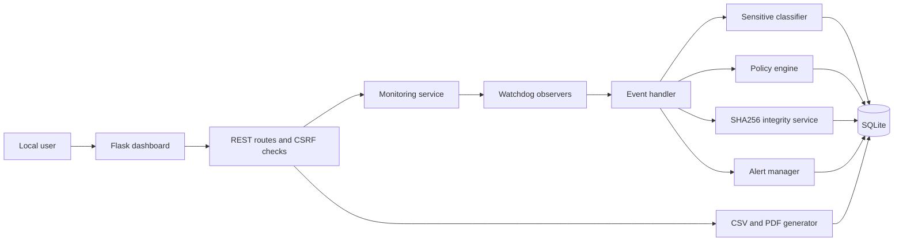
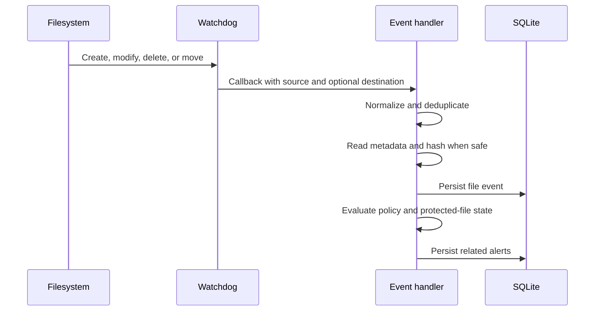
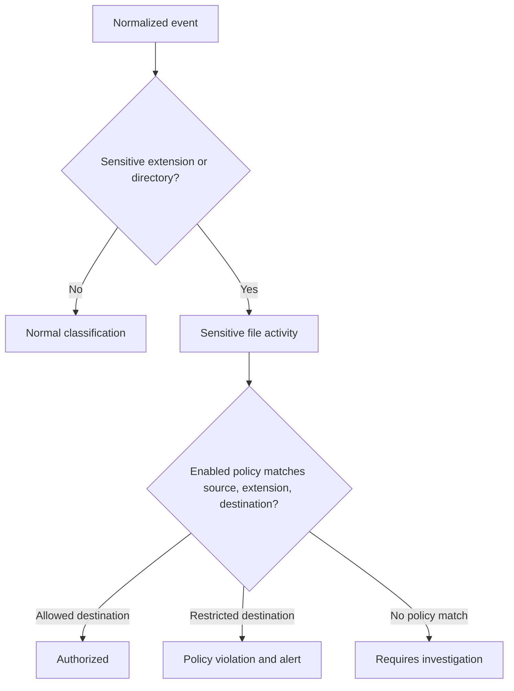
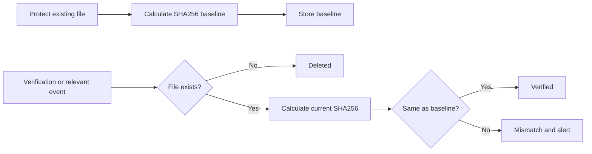
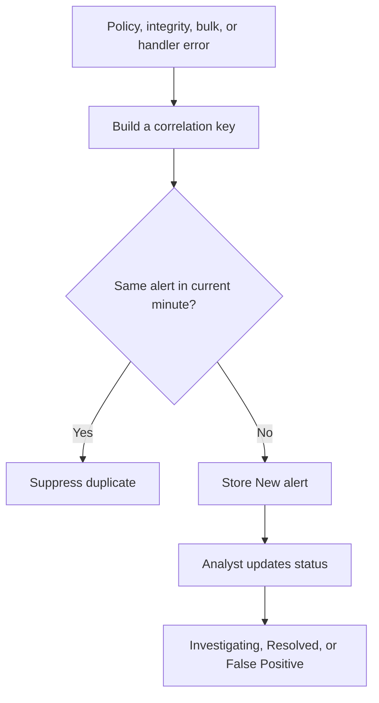
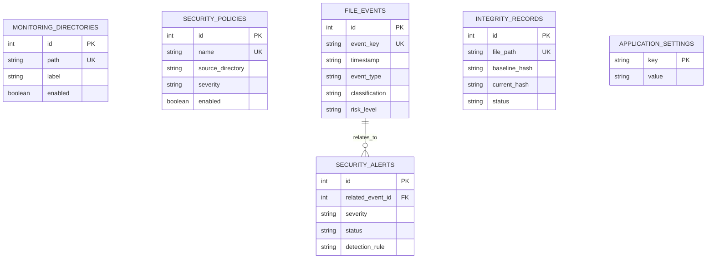

# SFTMS Architecture

## System architecture

```mermaid
flowchart LR
  User[Local user] --> UI[Flask dashboard]
  UI --> API[REST routes and CSRF checks]
  API --> Monitor[Monitoring service]
  Monitor --> Watchdog[Watchdog observers]
  Watchdog --> Handler[Event handler]
  Handler --> Classifier[Sensitive classifier]
  Handler --> Policy[Policy engine]
  Handler --> Integrity[SHA256 integrity service]
  Handler --> Alerts[Alert manager]
  Classifier --> DB[(SQLite)]
  Policy --> DB
  Integrity --> DB
  Alerts --> DB
  API --> Reports[CSV and PDF generator]
  Reports --> DB
```

## Filesystem event workflow

```mermaid
sequenceDiagram
  participant FS as Filesystem
  participant W as Watchdog
  participant H as Event handler
  participant D as SQLite
  FS->>W: Create, modify, delete, or move
  W->>H: Callback with source and optional destination
  H->>H: Normalize and deduplicate
  H->>H: Read metadata and hash when safe
  H->>D: Persist file event
  H->>H: Evaluate policy and protected-file state
  H->>D: Persist related alerts
```

## Classification flow

```mermaid
flowchart TD
  A[Normalized event] --> B{Sensitive extension or directory?}
  B -- No --> C[Normal classification]
  B -- Yes --> D[Sensitive file activity]
  D --> E{Enabled policy matches source, extension, destination?}
  E -- Allowed destination --> F[Authorized]
  E -- Restricted destination --> G[Policy violation and alert]
  E -- No policy match --> H[Requires investigation]
```

## Integrity workflow

```mermaid
flowchart LR
  A[Protect existing file] --> B[Calculate SHA256 baseline]
  B --> C[Store baseline]
  D[Verification or relevant event] --> E{File exists?}
  E -- No --> F[Deleted]
  E -- Yes --> G[Calculate current SHA256]
  G --> H{Same as baseline?}
  H -- Yes --> I[Verified]
  H -- No --> J[Mismatch and alert]
```

## Alert workflow

```mermaid
flowchart TD
  A[Policy, integrity, bulk, or handler error] --> B[Build a correlation key]
  B --> C{Same alert in current minute?}
  C -- Yes --> D[Suppress duplicate]
  C -- No --> E[Store New alert]
  E --> F[Analyst updates status]
  F --> G[Investigating, Resolved, or False Positive]
```

## Database ER diagram

```mermaid
erDiagram
  MONITORING_DIRECTORIES { int id PK string path UK string label boolean enabled }
  SECURITY_POLICIES { int id PK string name UK string source_directory string severity boolean enabled }
  FILE_EVENTS { int id PK string event_key UK string timestamp string event_type string classification string risk_level }
  INTEGRITY_RECORDS { int id PK string file_path UK string baseline_hash string current_hash string status }
  SECURITY_ALERTS { int id PK int related_event_id FK string severity string status string detection_rule }
  APPLICATION_SETTINGS { string key PK string value }
  FILE_EVENTS ||--o{ SECURITY_ALERTS : relates_to
```
